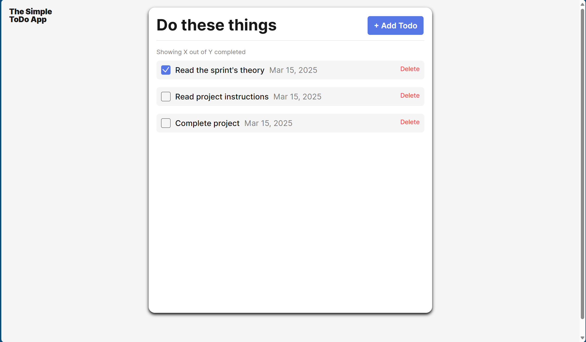
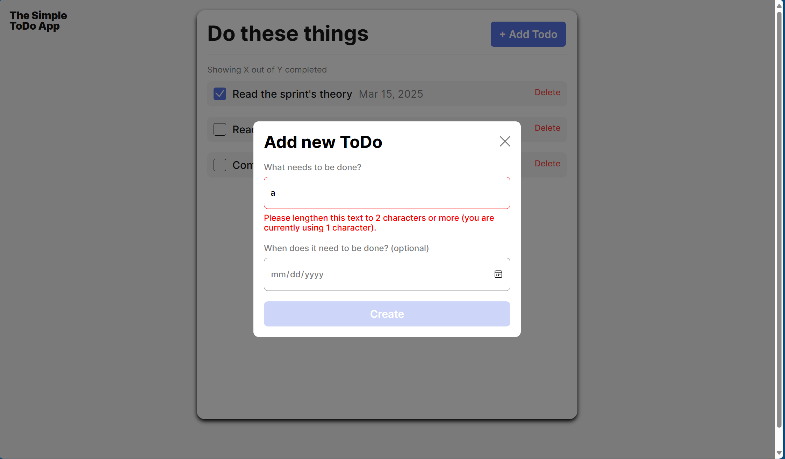
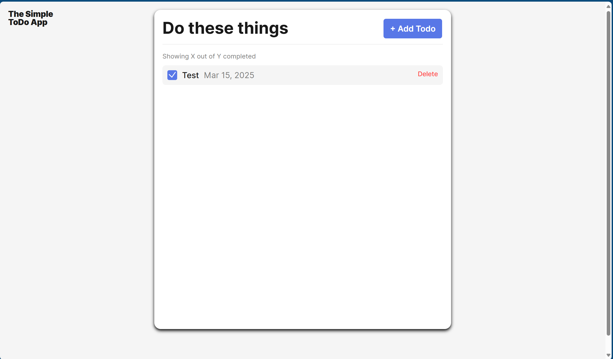

# Simple Todo App

The To-Do Application is a simple yet powerful tool for managing tasks and staying organized. This project allows users to add, delete, and edit their tasks in an intuitive interface. It's built with modern web technologies and follows best practices in design and coding, making it user-friendly and efficient.

## Functionality

Add new tasks with ease.

Mark tasks as complete or delete them.

Responsive design, optimized for desktops and mobile devices.

Lightweight and fast, with minimal loading times.

## Technology

HTML: To structure the application.

CSS: For styling and creating a clean, responsive design.

JavaScript with Object-Oriented Programming (OOP): Used to organize and structure code efficiently for better reusability and maintainability.

## Deployment

This project is deployed on GitHub Pages:

- [LINK](https://layz092.github.io/se_project_todo-app/)

## Images

